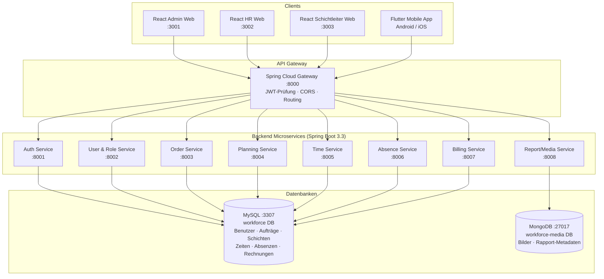

# Workforce Management System

Schulprojekt Modul 335 – Mobile Applikation  
Klasse: Modul 335

---

## Dokumentation

| Dokument | Beschreibung |
|---|---|
| [UML- & Architekturdiagramme](docs/diagrams.md) | Systemarchitektur, Klassendiagramm, ER-Diagramm, Sequenz- und Statusdiagramme (Mermaid) |
| [User Stories – HR](docs/userstories_hr.md) | User Stories mit Akzeptanzkriterien für die HR-Rolle |
| [User Stories – Schichtleiter](docs/userstories_schichtleiter.md) | User Stories mit Akzeptanzkriterien für die Schichtleiter-Rolle |
| [User Stories – Mitarbeiter](docs/userstories_mitarbeiter.md) | User Stories mit Akzeptanzkriterien für die Mitarbeiter-Rolle |
| [User Stories – Admin](docs/userstories_admin.md) | User Stories mit Akzeptanzkriterien für die Admin-Rolle |
| [Tests & CI-Pipeline](docs/testing-and-ci.md) | Wie Tests ausgeführt werden, was die CI-Pipeline prüft, was bei Fehlern zu tun ist |
| [Testbericht](docs/testreport.md) | Ergebnisse des automatischen API-Testlaufs (54/54 Tests bestanden) |
| [OWASP Top 10 Testplan](docs/owasp-testplan.md) | Sicherheits-Testplan mit OWASP-Kategorien, Befunden, Verbesserungen und offenen Punkten |
| [Flipper Auth Integration](docs/flipper-auth-integration.md) | Übernommene Flipper-, HCE-, ESP32- und Auth-Service-Teile |

---

## Quick Start – System starten & testen

### Voraussetzungen

- **Docker Desktop** installiert und gestartet
- Ports **3001–3004**, **8000–8009**, **3307**, **27017**, **8080**, **8081** sind frei

---

### Schritt 1 – Alles starten

Im Stammverzeichnis des Projekts (`Modul_335_Mobile_Applikation/`) ausführen:

**Erster Start oder nach einem Reset:**
```bash
docker compose down -v
docker compose up --build -d
```

**Folgestarts** (kein Code geändert, Daten sollen erhalten bleiben):
```bash
docker compose up -d
```

> **Erster Build:** dauert 3–5 Minuten (Maven-Dependencies, npm install).  
> **Folgestarts:** gehen in Sekunden, da Images bereits gebaut sind.

**Wichtig – Demo-Accounts:** Die Benutzer (`admin`, `hr.mueller`, `sl.huber`, `emp.meier`) werden **nicht** per SQL-Seed angelegt, sondern beim Start des `user-role-service` per `CommandLineRunner` mit korrekt generiertem BCrypt-Hash. MySQL-Healthcheck stellt sicher, dass die Rollen bereits vorhanden sind, bevor der Service startet.

Seeding prüfen:
```bash
docker compose logs user-role-service | grep Seed
```
Erwartete Ausgabe:
```
Seed-User angelegt: admin (ADMIN)
Seed-User angelegt: hr.mueller (HR)
Seed-User angelegt: sl.huber (SHIFT_LEAD)
Seed-User angelegt: emp.meier (EMPLOYEE)
```

---

### Schritt 2 – Browser-Zugänge

| Anwendung | URL | Beschreibung |
|---|---|---|
| **Admin-Frontend** | http://localhost:3001 | Rollen, Benutzerverwaltung, Aufträge |
| **HR-Frontend** | http://localhost:3002 | Schichtleiter anlegen, Stunden, Rechnungen, Absenzen |
| **Schichtleiter-Frontend** | http://localhost:3003 | Arbeitspläne, Schichten, Kalender |
| **Flipper Auth Dashboard** | http://localhost:3004 | Flipper-Login/Logout-Challenges testen |
| **phpMyAdmin** | http://localhost:8080 | MySQL-Datenbankadmin |
| **Mongo Express** | http://localhost:8081 | MongoDB-Admin (kein Login nötig) |

---

### Schritt 3 – Einloggen

Alle Frontends verwenden denselben Login-Endpunkt über den API-Gateway (`localhost:8000`). Die Demo-Accounts werden beim Start automatisch angelegt.

| Benutzername | Passwort | Rolle | Frontend |
|---|---|---|---|
| `admin` | `password` | Admin | http://localhost:3001 |
| `hr.mueller` | `password` | HR | http://localhost:3002 |
| `sl.huber` | `password` | Schichtleiter | http://localhost:3003 |
| `emp.meier` | `password` | Mitarbeiter | Flutter Mobile App |

> Jedes Frontend prüft nach dem Login die Rolle im JWT. `admin` kann sich z.B. **nicht** im HR-Frontend einloggen — falsche Rolle wird verweigert.

---

### Schritt 4 – Was kann ich wo tun?

**Admin** → http://localhost:3001

| Seite | Funktion |
|---|---|
| Rollen | Benutzer aus der DB anzeigen, Rolle ändern, deaktivieren/aktivieren |
| Aufträge | Aufträge über den Order Service erstellen, bearbeiten, zuweisen und Status ändern |
| HR / Mitarbeiter | Übersicht (lokal) |

**HR** → http://localhost:3002

| Seite | URL | Funktion |
|---|---|---|
| Benutzerverwaltung | `/users` | Schichtleiter/Mitarbeiter anlegen, bearbeiten, deaktivieren |
| Stundenübersicht | `/time` | Gesamtstunden, Monatsdetail und Pausenverstösse prüfen |
| Stundenfreigabe | `/hour-budgets` | Monatliche HR-Stundenkontingente für Schichtleiter festlegen |
| Rechnungen | `/invoices` | Rechnungen erstellen, versenden, als bezahlt markieren |
| Lohnauszüge | `/payroll` | Monatslohn aus Stunden, Rate, Zuschlägen und Abzügen berechnen |
| Absenzen & Ferien | `/absences` | Ferienanträge genehmigen/ablehnen, Absenzen erfassen |

**Schichtleiter** → http://localhost:3003

| Seite | URL | Funktion |
|---|---|---|
| Arbeitsplanung | `/planning` | Arbeitspläne mit HR-Stundenfreigabe erstellen, Schichten hinzufügen, veröffentlichen |
| Aufträge | `/orders` | Zugewiesene Aufträge aus dem Order Service einsehen und Status ändern |
| Arbeitszeiten | `/time` | Gesamtstunden, Monatsdetails und Pausenverstösse der Mitarbeiter einsehen |

**Flutter Mobile App** (Login: `emp.meier` / `password`)

| Screen | Funktion |
|---|---|
| Check-in/out | `POST /api/time/checkin`, `POST /api/time/checkout`; Pausenminuten werden beim Check-out mitgegeben |
| Kalender | `GET /api/planning/calendar/{employeeId}` – zeigt veröffentlichte Schichten des laufenden Monats |
| Absenzen | `POST /api/absences`, `GET /api/absences/employee/{employeeId}` |
| Rapport | `POST /api/media/upload` mit optionaler Auftrags-ID; Bild wird in MongoDB gespeichert |

---

### Schritt 5 – Automatische API-Tests ausführen

Wenn der Docker-Stack läuft, können die API-Tests aus dem `tests`-Ordner gestartet werden:

```bash
cd tests
node api-test.js
```

Die Tests verwenden den lokalen API-Gateway unter `http://localhost:8000`.

---

### Schritt 6 – API direkt testen (optional)

```
POST http://localhost:8000/api/auth/login
Content-Type: application/json

{
  "username": "hr.mueller",
  "password": "password"
}
```

Antwort:
```json
{
  "token": "eyJ...",
  "role": "HR",
  "username": "hr.mueller",
  "userId": 2
}
```

Den `token`-Wert als `Authorization: Bearer <token>` Header für alle weiteren API-Anfragen verwenden.

---

### Container verwalten

```bash
# Status aller Container anzeigen
docker compose ps

# Logs eines bestimmten Services live verfolgen
docker compose logs -f api-gateway
docker compose logs -f user-role-service
docker compose logs -f hr-web

# Alle Container stoppen (Daten bleiben erhalten)
docker compose down

# Einzelnen Service nach Code-Änderung neu bauen und starten
docker compose up --build user-role-service -d

# Kompletter Reset – stoppt alles und löscht alle Datenbankdaten
docker compose down -v && docker compose up --build -d
```

> `down -v` löscht die MySQL- und MongoDB-Volumes. Beim nächsten Start legt `init.sql` Schema und Rollen neu an, der `user-role-service` seeded die Demo-Accounts.

---

### Bekannte Stolpersteine

| Problem | Ursache | Lösung |
|---|---|---|
| Login schlägt mit 401 fehl | MySQL-Volume mit falsch geseedeten Usern aus alter Version | `docker compose down -v && docker compose up --build -d` |
| Login leitet sofort zurück auf `/login` | 401-Response vom Login-Endpoint triggerte früher einen Hard-Redirect | Behoben in `api.js` aller drei Frontends (Interceptor prüft jetzt ob Request = Login-Endpoint) |
| Admin zeigt 403 und kann Mitarbeiter oder Aufträge nicht laden/speichern | Im Browser ist noch ein abgelaufener oder ungültiger JWT gespeichert | Admin-Web entfernt bei 401/403 den alten Loginzustand und leitet zur erneuten Anmeldung weiter; User- und Order-Service antworten bei ungültigen Tokens korrekt mit 401 |
| Leere Seite ohne Login-Formular | `vite.config.js` fehlte → JSX wurde nicht verarbeitet | Behoben, `vite.config.js` ist vorhanden |
| CORS-Fehler 403 | Gateway hatte kein `globalcors`, Services gaben doppelte CORS-Header | Behoben: Gateway verwaltet CORS, Services haben `cors.disable()` |
| Admin zeigt andere User als HR-Frontend | `adminSeed.js` enthielt lokale Dummy-User (Amir Suter, Lea Baumann etc.); HR- und Mitarbeiter-Formulare schrieben in `localStorage` statt in die DB | Behoben in `DashboardPage.jsx`: `saveHrUser` und `saveEmployee` rufen jetzt `POST /api/users` auf; Suche und Stats verwenden echte API-Daten |
| Nach Wechsel auf neuen Rechner zeigt Admin noch alte Daten | Browser-`localStorage` vom alten Rechner enthält veralteten Admin-State | DevTools → Application → Local Storage → `planifywork-admin-state-v1` löschen, Seite neu laden |

---

## Inhaltsverzeichnis

1. [Projektidee](#1-projektidee)
2. [Technologie-Stack](#2-technologie-stack)
3. [Rollen & Zugänge](#3-rollen--zugänge)
4. [Gesamtarchitektur](#4-gesamtarchitektur)
5. [Projektstruktur](#5-projektstruktur)
6. [Services im Detail](#6-services-im-detail)
   - [API Gateway](#61-api-gateway--port-8000)
   - [Auth Service](#62-auth-service--port-8001)
   - [User & Role Service](#63-user--role-service--port-8002)
   - [Order Service](#64-order-service--port-8003)
   - [Planning Service](#65-planning-service--port-8004)
   - [Time Service](#66-time-service--port-8005)
   - [Absence & Vacation Service](#67-absence--vacation-service--port-8006)
   - [Billing Service](#68-billing-service--port-8007)
   - [Report / Media Service](#69-report--media-service--port-8008)
7. [Frontend-Apps](#7-frontend-apps)
8. [Mobile App (Flutter)](#8-mobile-app-flutter)
9. [Datenbanken](#9-datenbanken)
10. [Docker & lokale Umgebung](#10-docker--lokale-umgebung)
11. [Port-Übersicht](#11-port-übersicht)
12. [Arbeitsweise im Team (Kanban)](#12-arbeitsweise-im-team-kanban)
13. [Konventionen & Coding-Standards](#13-konventionen--coding-standards)

---

## 1. Projektidee

Das **Workforce Management System** ist eine verteilte Applikation zur Verwaltung von Mitarbeitern, Arbeitszeiten, Aufträgen, Schichten und Rechnungen.

Das System besteht aus:

- **3 React-Webapplikationen** für Admin, HR und Schichtleiter (Desktop)
- **1 Flutter-Mobile-App** für Mitarbeiter (iOS / Android)
- **8 Spring-Boot-Microservices** als Backend
- **MySQL** für strukturierte Daten
- **MongoDB** für Bild-Uploads und Mediendaten
- **Docker Compose** zur lokalen Ausführung aller Komponenten

---

## 2. Technologie-Stack

| Bereich        | Technologie             | Version  |
|----------------|-------------------------|----------|
| Frontend Web   | React + Vite            | React 18 |
| Mobile         | Flutter                 | SDK 3.3+ |
| Backend        | Spring Boot             | 3.3      |
| API Gateway    | Spring Cloud Gateway    | 2023.0   |
| Authentifizierung | JWT (jjwt)           | 0.12.5   |
| Datenbank 1    | MySQL                   | 8.0      |
| Datenbank 2    | MongoDB                 | 7.0      |
| Container      | Docker + Docker Compose | –        |
| DB-Admin       | phpMyAdmin + Mongo Express | –     |
| HTTP Client    | Axios (React) / http (Flutter) | – |
| State (Flutter)| Provider               | 6.1      |
| Routing (React)| React Router DOM        | v6       |

---

## 3. Rollen & Zugänge

| Rolle        | Zugang                               | JWT-Rolle    | Test-Benutzer  | Passwort   |
|--------------|--------------------------------------|--------------|----------------|------------|
| Admin        | Admin Web – http://localhost:3001    | `ADMIN`      | `admin`        | `password` |
| HR           | HR Web – http://localhost:3002       | `HR`         | `hr.mueller`   | `password` |
| Schichtleiter| Schichtleiter Web – http://localhost:3003 | `SHIFT_LEAD` | `sl.huber` | `password` |
| Mitarbeiter  | Flutter Mobile App                   | `EMPLOYEE`   | `emp.meier`    | `password` |

Jedes Frontend prüft nach dem Login die Rolle im JWT-Token. Stimmt die Rolle nicht überein, wird der Zugang verweigert.

Die Testbenutzer werden beim ersten Start des `user-role-service` automatisch in der Datenbank angelegt (via `CommandLineRunner` in `UserRoleServiceApplication.java`). Voraussetzung: Die Rollen müssen in der `roles`-Tabelle vorhanden sein (wird via `database/mysql/init.sql` beim ersten Start von MySQL erledigt).

---

## 4. Gesamtarchitektur



> Detaillierte Diagramme (ER, Klassendiagramm, Sequenz-, Statusdiagramme) → [docs/diagrams.md](docs/diagrams.md)

---

## 5. Projektstruktur

```
Modul_335_Mobile_Applikation/
│
├── docker-compose.yml              # Startet alle Container
├── .gitignore
│
├── backend/                        # Spring Boot Microservices
│   ├── api-gateway/                # Zentraler Einstiegspunkt, JWT-Prüfung
│   ├── auth-service/               # Login, Logout, JWT erstellen
│   ├── user-role-service/          # Benutzerverwaltung, Rollen
│   ├── order-service/              # Auftragsmanagement
│   ├── planning-service/           # Arbeitsplanung, Schichten
│   ├── time-service/               # Check-in/out, Arbeitszeitberechnung
│   ├── absence-vacation-service/   # Absenzen und Ferien
│   ├── billing-service/            # Rechnungen
│   └── report-media-service/       # Bild-Upload (MongoDB)
│
├── frontend/                       # React Webapplikationen
│   ├── admin-web/                  # Admin-Oberfläche
│   ├── hr-web/                     # HR-Oberfläche
│   └── shiftlead-web/              # Schichtleiter-Oberfläche
│
├── mobile/                         # Flutter Mobile App
│   └── lib/
│       ├── main.dart
│       ├── screens/                # UI-Screens
│       └── services/               # API- und Auth-Logik
│
└── database/
    ├── mysql/init.sql              # MySQL Schema + Seed-Daten
    └── mongodb/init.js             # MongoDB Collection-Setup
```

Jeder Spring-Boot-Service hat dieselbe interne Struktur:

```
<service-name>/
├── Dockerfile
├── pom.xml
└── src/main/
    ├── java/com/workforce/<name>/
    │   ├── <Name>Application.java  # Einstiegspunkt
    │   ├── controller/             # REST-Endpoints (@RestController)
    │   ├── service/                # Geschäftslogik
    │   ├── model/                  # Entities / Datenmodelle
    │   ├── repository/             # Datenbankzugriff (JPA / MongoDB)
    │   └── config/                 # Security, JWT, CORS etc.
    └── resources/
        └── application.yml         # Port, DB-Verbindung, JWT-Secret
```

Jede React-App hat dieselbe interne Struktur:

```
<app-name>/
├── Dockerfile
├── nginx.conf
├── package.json
├── index.html
└── src/
    ├── main.jsx                    # React-Einstiegspunkt
    ├── App.jsx                     # Router-Setup, Protected Routes
    ├── pages/                      # Seitenkomponenten (LoginPage, Dashboard...)
    ├── components/                 # Wiederverwendbare UI-Komponenten
    └── services/
        └── api.js                  # Axios-Instanz mit JWT-Interceptor
```

---

## 6. Services im Detail

### 6.1 API Gateway · Port 8000

**Aufgabe:** Einziger Einstiegspunkt für alle Frontends. Leitet HTTP-Anfragen anhand des URL-Pfades an den passenden Microservice weiter.

**Routing-Tabelle:**

| Pfad-Prefix     | Ziel-Service              |
|-----------------|---------------------------|
| `/api/auth/**`  | auth-service :8001        |
| `/api/users/**` | user-role-service :8002   |
| `/api/orders/**`| order-service :8003       |
| `/api/planning/**` | planning-service :8004 |
| `/api/time/**`  | time-service :8005        |
| `/api/absences/**` | absence-vacation-service :8006 |
| `/api/billing/**` | billing-service :8007   |
| `/api/media/**` | report-media-service :8008|

**Noch zu implementieren:**
- JWT-Filter (Token prüfen, bevor Anfrage weitergeleitet wird)
- CORS-Konfiguration für alle Frontends
- Rate Limiting (optional)

---

### 6.2 Auth Service · Port 8001

**Aufgabe:** Authentifizierung. Erstellt JWT-Tokens nach erfolgreichem Login.

**Bereits implementiert:**
- `POST /api/auth/login` → gibt JWT-Token + Rolle zurück
- `GET /api/auth/validate` → prüft ob ein Token gültig ist
- `User`- und `Role`-Entity mit JPA
- `UserRepository` (findByUsername, findByEmail)
- `JwtUtil` (Token erstellen, validieren, Rolle/Username extrahieren)
- Spring Security Konfiguration (stateless, BCrypt)

**Noch zu implementieren:**
- `POST /api/auth/logout` (Token-Blacklist oder Frontend-seitig)
- Passwort ändern
- Erster Admin-Benutzer per Seed-Script

---

### 6.3 User & Role Service · Port 8002

**Aufgabe:** Verwaltung aller Benutzer und ihrer Rollen.

**Noch zu implementieren:**
- `GET /api/users` – alle Benutzer auflisten (Admin)
- `POST /api/users` – neuen Benutzer anlegen
- `PUT /api/users/{id}` – Benutzer bearbeiten
- `DELETE /api/users/{id}` – Benutzer deaktivieren
- `GET /api/users/{id}` – Benutzerdetails
- Entities: `User`, `Role`
- Repository, Service, Controller

---

### 6.4 Order Service · Port 8003

**Aufgabe:** Auftragsmanagement. Admin erstellt Aufträge, Schichtleiter empfangen sie, Mitarbeiter können Auftragsdaten herunterladen.

**Implementiert:**
- `GET /api/orders` – Aufträge auflisten, optional mit `?shiftLeadId=` und `?status=` filtern
- `GET /api/orders/{id}` – Auftragsdetail anzeigen
- `POST /api/orders` – Auftrag erstellen (Admin)
- `PUT /api/orders/{id}` – Auftrag bearbeiten (Admin)
- `PUT /api/orders/{id}/assign` – Schichtleiter/Mitarbeiter zuweisen (Admin)
- `PUT /api/orders/{id}/status` – Status ändern (Admin/Schichtleiter)
- `GET /api/orders/{id}/download` – Auftragsdaten als JSON abrufen
- Entities: `WorkOrder`, `OrderEmployee`
- Status-Enum: `OPEN`, `IN_PROGRESS`, `DONE`

**Beispiel: Auftrag erstellen**

```http
POST http://localhost:8000/api/orders
Authorization: Bearer <admin-token>
Content-Type: application/json

{
  "title": "Umbau Eingang A",
  "description": "Material prüfen und Rapportbilder hochladen",
  "company": "Demo AG",
  "location": "Zürich",
  "startDate": "2026-06-01",
  "endDate": "2026-06-30",
  "requiredRole": "Montage",
  "assignedShiftLeadId": 3,
  "createdBy": 1,
  "status": "OPEN",
  "employeeIds": [4]
}
```

---

### 6.5 Planning Service · Port 8004

**Aufgabe:** HR gibt monatliche Stundenkontingente pro Schichtleiter frei. Schichtleiter erstellen darauf basierend Arbeitspläne für ihr Team. Mitarbeiter sehen veröffentlichte Schichten im Mobile-Kalender.

**Implementiert:**
- `POST /api/planning/hour-budgets` – HR-Stundenkontingent pro Schichtleiter und Monat erstellen/aktualisieren
- `GET /api/planning/hour-budgets` – HR-Stundenkontingente auflisten, optional mit `?shiftLeadId=` filtern
- `POST /api/planning/workplans` – Arbeitsplan erstellen und HR-Stundenkontingent automatisch übernehmen
- `GET /api/planning/workplans` – Arbeitspläne auflisten, optional mit `?shiftLeadId=` filtern
- `GET /api/planning/workplans/{id}` – Arbeitsplan inkl. Schichten und Stundenübersicht anzeigen
- `PUT /api/planning/workplans/{id}` – Arbeitsplan-Entwurf bearbeiten
- `POST /api/planning/workplans/{id}/shifts` – Schicht hinzufügen, optional mit `orderId`
- `PUT /api/planning/workplans/{id}/publish` – Arbeitsplan veröffentlichen
- `GET /api/planning/calendar/{employeeId}` – veröffentlichte Kalenderschichten eines Mitarbeiters anzeigen
- Entities: `HourBudget`, `WorkPlan`, `Shift`, `WorkPlanStatus`

**Stundenlogik:**
- `approvedHours` wird aus der HR-Stundenfreigabe übernommen und nicht mehr vom Schichtleiter eingegeben.
- `plannedHours` wird aus allen Schichten eines Arbeitsplans berechnet.
- `remainingHours` zeigt die Differenz zwischen freigegebenen und geplanten Stunden.
- `overLimit` wird `true`, wenn mehr als das HR-Kontingent geplant wurde.
- `underPlanned` wird `true`, wenn weniger als 95 % des HR-Kontingents geplant wurden.

**Beispiel: HR-Stundenfreigabe erstellen**

```http
POST http://localhost:8000/api/planning/hour-budgets
Authorization: Bearer <hr-token>
Content-Type: application/json

{
  "shiftLeadId": 3,
  "year": 2026,
  "month": 6,
  "approvedHours": 1000,
  "createdBy": 2,
  "notes": "Sommermonat Juni"
}
```

**Beispiel: Arbeitsplan erstellen**

```http
POST http://localhost:8000/api/planning/workplans
Authorization: Bearer <token>
Content-Type: application/json

{
  "title": "Monatsplan Juni",
  "shiftLeadId": 3,
  "startDate": "2026-06-01",
  "endDate": "2026-06-30"
}
```

**Beispiel: Schicht hinzufügen**

```http
POST http://localhost:8000/api/planning/workplans/1/shifts
Authorization: Bearer <token>
Content-Type: application/json

{
  "employeeId": 4,
  "orderId": null,
  "shiftDate": "2026-06-03",
  "startTime": "08:00",
  "endTime": "17:00",
  "notes": "Tagesschicht"
}
```

---

### 6.6 Time Service · Port 8005

**Aufgabe:** Check-in / Check-out erfassen, Arbeitsstunden berechnen, Auswertungen bereitstellen.

**Implementiert:**
- `POST /api/time/checkin` – Check-in speichern
- `POST /api/time/checkout` – Check-out speichern und Netto-Arbeitszeit berechnen
- `GET /api/time/current/{employeeId}` – aktuell offener Check-in eines Mitarbeiters
- `GET /api/time/latest/{employeeId}` – letzter Zeiteintrag eines Mitarbeiters
- `GET /api/time/today/{employeeId}` – heutiger Zeiteintrag eines Mitarbeiters
- `GET /api/time/month/{employeeId}?month=&year=` – Monatsauswertung pro Mitarbeiter
- `GET /api/time/total?from=&to=` – Gesamtstunden aller Mitarbeiter im Zeitraum
- `GET /api/time/total/{employeeId}?from=&to=` – Gesamtstunden eines Mitarbeiters im Zeitraum
- `GET /api/time/break-violations?from=&to=&employeeId=` – Pausenverstösse auswerten
- Rollen: HR/Admin für Auswertungen, Schichtleiter für Team-Übersicht, Mitarbeiter für eigenen Check-in/out
- Entities: `TimeEntry`
- Berechnung: Netto-Stunden aus Check-in, Check-out und Pausenzeit
- Pausenregel: mehr als 6 Stunden Brutto-Arbeitszeit → mindestens 30 Minuten Pause; mehr als 9 Stunden → mindestens 45 Minuten Pause

---

### 6.7 Absence & Vacation Service · Port 8006

**Aufgabe:** Ferienanfragen und Absenzen verwalten.

**Implementiert:**
- `POST /api/absences` – Absenz/Ferienanfrage einreichen (Mitarbeiter, HR, Admin)
- `GET /api/absences/employee/{employeeId}` – eigene Absenzen/Ferienanfragen für die Mobile App laden
- `GET /api/absences` – Absenzen nach Mitarbeiter und/oder Typ filtern
- `GET /api/absences/pending` – offene Anfragen (HR)
- `PUT /api/absences/{id}/approve` – genehmigen (HR)
- `PUT /api/absences/{id}/reject` – ablehnen (HR)
- `PUT /api/absences/{id}` – Abwesenheit bearbeiten (HR/Admin)
- `DELETE /api/absences/{id}` – Abwesenheit löschen (HR/Admin)
- Entities: `Absence`
- Type-Enum: `VACATION`, `SICK`, `OTHER`
- Status-Enum: `PENDING`, `APPROVED`, `REJECTED`

---

### 6.8 Billing Service · Port 8007

**Aufgabe:** HR erstellt Rechnungen und monatliche Lohnauszüge basierend auf erfassten Arbeitsstunden.

**Implementiert Rechnungen:**
- `POST /api/billing/invoices` – Rechnung erstellen
- `GET /api/billing/invoices` – alle Rechnungen
- `GET /api/billing/invoices/{id}` – Rechnungsdetail
- `PUT /api/billing/invoices/{id}/send` – Rechnung versenden
- `PUT /api/billing/invoices/{id}/pay` – Rechnung als bezahlt markieren
- Entities: `Invoice`, `InvoicePosition`
- Status-Enum: `DRAFT`, `SENT`, `PAID`

**Implementiert Lohnauszüge:**
- `POST /api/billing/payroll-statements` – Lohnauszug aus Monatsstunden, Stundenrate, Zuschlägen und Abzügen erstellen oder neu berechnen
- `GET /api/billing/payroll-statements` – Lohnauszüge auflisten, optional mit `?status=` filtern
- `GET /api/billing/payroll-statements/{id}` – Lohnauszug anzeigen
- `PUT /api/billing/payroll-statements/{id}/approve` – Lohnauszug freigeben
- `PUT /api/billing/payroll-statements/{id}/pay` – Lohnauszug als bezahlt markieren
- Entities: `PayrollStatement`, `PayrollStatus`
- Status-Enum: `DRAFT`, `APPROVED`, `PAID`
- Stundendaten kommen aus `time_entries` des Time Service

---

### 6.9 Report / Media Service · Port 8008

**Aufgabe:** Bild-Uploads aus der Mobile App empfangen und in MongoDB speichern.

**Implementiert:**
- `POST /api/media/upload` – Bild aus der Mobile App per Multipart hochladen
- `GET /api/media/{id}` – Bilddatei aus MongoDB abrufen
- `GET /api/media/order/{orderId}` – alle Rapportbilder eines Auftrags auflisten
- `GET /api/media/employee/{employeeId}` – alle Rapportbilder eines Mitarbeiters auflisten
- MongoDB-Document: `MediaReport` (employeeId, orderId, rapportId, filename, contentType, fileSize, storagePath, uploadedAt, metadata, data)
- Bilddaten werden direkt in MongoDB gespeichert; maximale Upload-Grösse: 10 MB

**Beispiel: Rapportbild hochladen**

```http
POST http://localhost:8000/api/media/upload
Authorization: Bearer <employee-token>
Content-Type: multipart/form-data

file=<bild.jpg>
employeeId=4
orderId=1
note=Rapportfoto Eingang A
```

---

## 7. Frontend-Apps

### Gemeinsame Basis (alle 3 Apps)

- **Vite** als Build-Tool
- **React Router v6** für clientseitiges Routing
- **Axios** mit JWT-Interceptor (`src/services/api.js`)
  - Setzt automatisch den `Authorization: Bearer <token>` Header
  - Leitet bei 401 automatisch auf `/login` weiter
- **Protected Routes** – nicht eingeloggte Nutzer werden auf `/login` umgeleitet
- Login prüft die JWT-Rolle, falsche Rolle = Zugang verweigert

### Admin Web · Port 3001

**Implementiert:**
- Login mit Rollenprüfung `ADMIN`
- Dashboard mit vollständiger Navigation (Übersicht, Aufträge, HR, Firmenkonzepte, Lohn und Stunden, Mitarbeiter, Rollen, Berichte, Suche, Audit-Log)
- Rollen-Tab: alle Benutzer aus der DB anzeigen, Rolle ändern, deaktivieren/aktivieren (`GET /api/users`, `PUT /api/users/:id`)
- HR-Tab: HR-Benutzer aus DB anzeigen, anlegen, bearbeiten und deaktivieren/aktivieren (`GET /api/users?role=HR`, `POST /api/users`, `PUT /api/users/:id`)
- Mitarbeiter-Tab: Mitarbeiter aus DB anzeigen, anlegen, bearbeiten und deaktivieren/aktivieren (`GET /api/users?role=EMPLOYEE`, `POST /api/users`, `PUT /api/users/:id`)
- Aufträge: werden über den Order Service gespeichert (`GET/POST/PUT /api/orders`)
- Firmenkonzepte, Stunden-/Lohnregeln, Berichte, Audit-Log: weiterhin lokal im Browser
- Suche und Übersichts-Statistiken verwenden echte DB-Daten für Benutzer/Mitarbeiter/Aufträge

> **Hinweis:** Firmenkonzepte, Stunden- und Lohnregeln werden aktuell noch im `localStorage` des Browsers gespeichert. Aufträge sind jetzt backendgestützt und bleiben in MySQL erhalten.

> **Hinweis Bearbeiten-Formular:** Beim Bearbeiten eines bestehenden HR- oder Mitarbeiter-Benutzers werden Benutzername und Passwort ausgeblendet, da der `PUT /api/users/:id` Endpunkt diese Felder nicht akzeptiert (Benutzername ist eindeutig und unveränderlich; Passwortänderung ist nicht implementiert).

**Noch zu implementieren:**
- Firmendaten-Seite (`/company`)
- Stundenübersicht aus dem Time Service laden

### HR Web · Port 3002

**Implementiert:**
- Login mit Rollenprüfung `HR`
- Benutzerverwaltung (`/users`): Schichtleiter/Mitarbeiter anlegen, bearbeiten, deaktivieren
- Stundenübersicht (`/time`): Gesamtstunden, Monatsdetail und Pausenverstösse prüfen
- Stundenfreigabe (`/hour-budgets`): Monatskontingente pro Schichtleiter freigeben
- Rechnungen (`/invoices`): Erstellen, versenden, als bezahlt markieren (DRAFT → SENT → PAID)
- Lohnauszüge (`/payroll`): Monatslohn aus Stunden, Stundenrate, Zuschlägen und Abzügen berechnen (DRAFT → APPROVED → PAID)
- Absenzen & Ferien (`/absences`): Ferienanfragen genehmigen/ablehnen, Absenzen erfassen und verwalten

**Noch zu implementieren:**
- Abwesenheitskalender (`/absences/calendar`) — Backend-Endpunkt vorhanden, Frontend-Widget fehlt (US-HR-10)

### Schichtleiter Web · Port 3003

**Implementiert:**
- Login mit Rollenprüfung `SHIFT_LEAD` und Speicherung von `userId`
- Dashboard mit Kacheln für Planung, Aufträge und Notizen
- Arbeitsplan-Erstellung (`/planning`) mit automatisch übernommener HR-Stundenfreigabe
- Schichten hinzufügen inklusive Mitarbeiter-Auswahl, optionaler Auftrag-ID und Notiz
- Stundenübersicht mit HR-Kontingent, geplanten Stunden, Reststunden und Warnungen
- Arbeitszeiten-Seite (`/time`) lädt Gesamtstunden, Monatsdetails und Pausenverstösse aus dem Time Service
- Arbeitsplan veröffentlichen, damit Mitarbeiter die Schichten im Mobile-Kalender sehen

**Implementiert zusätzlich:**
- Auftrags-Ansicht (`/orders`) lädt zugewiesene Aufträge aus dem Order Service
- Schichtleiter kann den Auftragsstatus auf `OPEN`, `IN_PROGRESS` oder `DONE` setzen
- Arbeitsplanung bietet zugewiesene Aufträge als Auswahl für neue Schichten an

**Vorbereitet:**
- Notizen-Übersicht (`/notes`) als Platzhalter; Schichtnotizen werden bereits im Arbeitsplan gespeichert

---

## 8. Mobile App (Flutter)

**Verzeichnis:** `mobile/`  
**Rolle:** Mitarbeiter (`emp.meier` / `password`)  
**Technologie:** Flutter SDK 3.3+, Provider 6.1, http, SharedPreferences, image_picker

Die Mobile App verbindet sich mit demselben API Gateway (`:8000`) und verwendet dasselbe JWT wie die drei Web-Frontends. Sie ist **ausschliesslich für die Rolle `EMPLOYEE`** gedacht.

---

### Voraussetzungen (Entwicklungsumgebung)

- **Flutter SDK** ≥ 3.3 ([flutter.dev/docs/get-started/install](https://flutter.dev/docs/get-started/install))
- **Android Studio** mit installiertem Android Emulator (API 33+) **oder** ein physisches Android-Gerät
- **Docker-Stack läuft** (`docker compose up -d`) – die App spricht gegen den Backend-Stack

---

### Schritt 1 – API-URL konfigurieren

Die Basis-URL für alle API-Anfragen steht zentral in einer Datei:

```
mobile/lib/services/api_config.dart
```

```dart
class ApiConfig {
  // Android Emulator: 10.0.2.2 = localhost des Host-Rechners
  // Echtes Gerät im selben WLAN: lokale IP des Host-Rechners (z.B. 192.168.1.x)
  static const String baseUrl = 'http://10.0.2.2:8000';
  static const Duration requestTimeout = Duration(seconds: 8);
}
```

| Situation | Wert für `baseUrl` |
|---|---|
| Android-Emulator (Standard) | `http://10.0.2.2:8000` |
| Echtes Gerät im selben WLAN | `http://<lokale-IP-des-Rechners>:8000` |
| iOS-Simulator | `http://localhost:8000` |

> Die lokale IP des Rechners findet man unter Windows mit `ipconfig` (z.B. `192.168.1.42`), unter macOS/Linux mit `ifconfig` oder `ip a`.

**Wichtig:** Nach einer URL-Änderung muss die App neu gebaut werden (`flutter run`).

---

### Schritt 2 – App starten

```bash
cd mobile
flutter pub get          # Dependencies installieren (einmalig)
flutter run              # App im verbundenen Emulator / Gerät starten
```

Alternativer Start direkt im Android Studio:
1. Emulator über **Device Manager** starten
2. In der Run-Konfiguration das `mobile/`-Verzeichnis auswählen
3. **Run** drücken

---

### Schritt 3 – Einloggen

| Feld | Wert |
|---|---|
| Benutzername | `emp.meier` |
| Passwort | `password` |

Die App ruft `POST /api/auth/login` auf denselben API Gateway auf wie die Web-Frontends. Nach erfolgreichem Login speichert sie `token`, `role`, `username` und `userId` in den `SharedPreferences` des Geräts. Das JWT ist 24 Stunden gültig.

> Die App prüft die Rolle **nicht** beim Login – technisch kann jeder Systembenutzer die Mobile App verwenden. Im Normalbetrieb ist sie für die Rolle `EMPLOYEE` vorgesehen.

---

### Screens und API-Endpoints

#### Tab 1 – Check-in / Check-out

Ermöglicht dem Mitarbeiter, die Arbeitszeit direkt aus der App zu erfassen.

| Aktion | Endpoint | Payload |
|---|---|---|
| Status laden | `GET /api/time/current/{userId}` | – |
| Check-in | `POST /api/time/checkin` | `{ "employeeId": 4 }` |
| Check-out | `POST /api/time/checkout` | `{ "employeeId": 4, "breakMinutes": 30 }` |

- Beim Check-out wird die Pausenzeit in Minuten abgezogen
- Die Netto-Arbeitsstunden werden vom Time Service berechnet und zurückgegeben
- Ist der Mitarbeiter bereits eingecheckt, zeigt die App den aktuellen Check-in-Zeitpunkt

#### Tab 2 – Kalender

Zeigt die veröffentlichten Schichten des Mitarbeiters für den laufenden Monat.

| Aktion | Endpoint |
|---|---|
| Schichten laden | `GET /api/planning/calendar/{userId}?from=YYYY-MM-DD&to=YYYY-MM-DD` |

> Schichten sind nur sichtbar, wenn der Schichtleiter den Arbeitsplan **veröffentlicht** hat (Status `PUBLISHED`). Entwürfe (`DRAFT`) erscheinen nicht.

#### Tab 3 – Absenzen & Ferien

Mitarbeiter kann eigene Ferienanträge und Absenzen einreichen und den Status einsehen.

| Aktion | Endpoint | Payload |
|---|---|---|
| Absenzen laden | `GET /api/absences/employee/{userId}` | – |
| Absenz einreichen | `POST /api/absences` | `{ "employeeId": 4, "type": "VACATION", "startDate": "...", "endDate": "...", "reason": "..." }` |

Typen: `VACATION` (Ferien), `SICK` (Krank), `OTHER` (Sonstiges)  
Status: `PENDING` → `APPROVED` / `REJECTED` (wird von HR gesetzt)

#### Tab 4 – Rapport / Foto-Upload

Mitarbeiter fotografiert den Arbeitsort und lädt das Bild mit optionaler Auftrags-ID hoch.

| Aktion | Endpoint |
|---|---|
| Bild hochladen | `POST /api/media/upload` (Multipart) |

Felder: `file` (Bilddatei), `employeeId`, `orderId` (optional), `note` (optional)  
Das Bild wird in **MongoDB** (`workforce-media.media_reports`) gespeichert. Max. 10 MB.

---

### Architektur der Mobile App

```
mobile/lib/
├── main.dart                    # App-Einstieg, Provider-Setup, Login/Home-Weiche
├── services/
│   ├── api_config.dart          # Zentrale URL-Konfiguration (hier bei Bedarf anpassen)
│   ├── api_service.dart         # GET, POST, Multipart-Upload mit JWT-Header
│   └── auth_service.dart        # Login, Logout, JWT/UserId/Rolle (SharedPreferences)
└── screens/
    ├── login_screen.dart        # Login-UI
    ├── home_screen.dart         # Bottom-Navigation (4 Tabs)
    ├── checkin_screen.dart      # Check-in / Check-out → Time Service
    ├── calendar_screen.dart     # Monatskalender → Planning Service
    ├── absence_screen.dart      # Absenzen einreichen und anzeigen → Absence Service
    └── report_screen.dart       # Kamera → Bild-Upload → Report/Media Service
```

Alle API-Aufrufe laufen ausschliesslich über `ApiService`. Kein Screen ruft `http` direkt auf. Der `AuthService` verwaltet den Login-Zustand und stellt den JWT-Header für alle Requests bereit.

---

### Troubleshooting Mobile

| Problem | Ursache | Lösung |
|---|---|---|
| `Backend nicht erreichbar` | Falsche `baseUrl` in `api_config.dart` | URL auf `10.0.2.2:8000` (Emulator) oder lokale IP (echtes Gerät) setzen |
| `Nicht autorisiert` (401) | Token abgelaufen (24h) oder nie gesetzt | Ausloggen und neu einloggen |
| Keine Schichten im Kalender | Schichtleiter hat Plan noch nicht veröffentlicht | Im Schichtleiter-Web Plan veröffentlichen (Status → PUBLISHED) |
| Kamera öffnet sich nicht | `image_picker` Berechtigungen fehlen | Android: Kameraberechtigung in App-Einstellungen erteilen |
| Upload schlägt mit 413 fehl | Bild grösser als 10 MB | Kleinere Auflösung / niedrigere Bildqualität wählen |

### Noch zu implementieren

- Auftragsdaten herunterladen (`GET /api/orders/{id}/download`)
- Eigenes Benutzerprofil anzeigen

---

## 9. Datenbanken

### MySQL · Host-Port 3307 / Container-Port 3306

Wird verwendet für **alle strukturierten Daten**.

**Datenbank:** `workforce`  
**Benutzer:** `workforce` / `workforce`

Intern verwenden die Backend-Services weiterhin `mysql-db:3306`. Auf dem Windows-Host ist MySQL über `localhost:3307` erreichbar, damit es keinen Konflikt mit einer lokal installierten Windows-MySQL-Instanz auf Port 3306 gibt.

Tabellen (automatisch angelegt via `database/mysql/init.sql`):

| Tabelle | Inhalt |
|---|---|
| `roles` | ADMIN, HR, SHIFT_LEAD, EMPLOYEE |
| `users` | Alle Benutzer mit Rollenzuweisung |
| `orders` | Aufträge inklusive Firma, Einsatzort, Zeitraum, Status und Schichtleiter-Zuweisung |
| `order_employees` | Zuordnung Mitarbeiter ↔ Auftrag |
| `work_plans` | Arbeitspläne inkl. HR-Stundenkontingent, Status und Veröffentlichungszeitpunkt |
| `shifts` | Einzelschichten mit Mitarbeiter- und optionalem Auftragsbezug |
| `time_entries` | Check-in/out Einträge |
| `absences` | Absenzen und Ferienanfragen |
| `invoices` | Rechnungen |
| `invoice_positions` | Rechnungspositionen |

**phpMyAdmin:** [http://localhost:8080](http://localhost:8080)

### MongoDB · Port 27017

Wird verwendet für **Bild-Uploads aus der Mobile App**.

**Datenbank:** `workforce-media`  
**Benutzer:** `workforce` / `workforce`

Collection: `media_reports`

```json
{
  "employee_id": 42,
  "order_id": 7,
  "rapport_id": "uuid-...",
  "filename": "bild_2024_01.jpg",
  "content_type": "image/jpeg",
  "file_size": 204800,
  "storage_path": "mongodb://workforce-media/media_reports/uuid-...",
  "uploaded_at": "2024-01-15T14:30:00Z",
  "metadata": { "note": "Rapportfoto Eingang A" },
  "data": "<binary image data>"
}
```

**Mongo Express:** [http://localhost:8081](http://localhost:8081)

---

## 10. Docker & lokale Umgebung

### Voraussetzungen

- [Docker Desktop](https://www.docker.com/products/docker-desktop/) installiert und gestartet
- Ports **3001–3004**, **8000–8009**, **3307**, **27017**, **8080**, **8081** sind frei
- Node.js v18+ nur nötig, wenn Frontends im Entwicklungsmodus (ausserhalb Docker) gestartet werden

---

### Alles starten (empfohlener Befehl)

```bash
docker compose up --build -d
```

Startet alle Container auf einmal: Datenbanken, alle 8 Backend-Services, alle 3 Frontends und die DB-Admins.

| Flag | Bedeutung |
|---|---|
| `--build` | Bilder neu bauen (nötig beim ersten Start und nach Code-Änderungen) |
| `-d` | Hintergrundmodus (Terminal bleibt frei) |

> Folgestarts ohne Code-Änderungen: `docker compose up -d` (kein `--build`, startet in Sekunden).

---

### Container-Status prüfen

```bash
docker compose ps
```

`mysql-db` muss den Status `healthy` haben, bevor die Backend-Services bereit sind. Wenn ein Service `unhealthy` zeigt, Logs prüfen.

---

### Logs anzeigen

```bash
# Live-Log eines Services
docker compose logs -f api-gateway
docker compose logs -f user-role-service
docker compose logs -f absence-vacation-service

# Letzten 50 Zeilen ohne Live-Follow
docker compose logs --tail=50 hr-web
```

---

### Einzelnen Service neu bauen (nach Code-Änderung)

```bash
# Ein Service
docker compose up --build user-role-service -d

# Mehrere Services gleichzeitig
docker compose up --build auth-service user-role-service absence-vacation-service -d
```

---

### Nur Datenbanken starten (für IntelliJ-Entwicklung)

```bash
docker compose up mysql-db mongo-db phpmyadmin mongo-express -d
```

Spring-Boot-Services können dann direkt aus IntelliJ gestartet werden (`SPRING_PROFILES_ACTIVE=local`).

---

### Alle Container stoppen

```bash
# Stoppen – Daten bleiben erhalten
docker compose down

# Stoppen + alle Volumes löschen (DB-Reset)
docker compose down -v
```

> Nach `docker compose down -v`: beim nächsten `docker compose up --build -d` werden Schema, Rollen und alle Demo-Accounts automatisch neu angelegt.

---

### Browser-Zugänge (Übersicht)

| Anwendung | URL | Login |
|---|---|---|
| Admin-Frontend | http://localhost:3001 | `admin` / `password` |
| HR-Frontend | http://localhost:3002 | `hr.mueller` / `password` |
| Schichtleiter-Frontend | http://localhost:3003 | `sl.huber` / `password` |
| Flipper Auth Dashboard | http://localhost:3004 | *(kein Login)* |
| phpMyAdmin | http://localhost:8080 | `workforce` / `workforce` |
| Mongo Express | http://localhost:8081 | *(kein Login)* |
| API Gateway | http://localhost:8000 | *(direkte API-Calls)* |

---

## 11. Port-Übersicht

| Komponente             | Port  |
|------------------------|-------|
| API Gateway            | 8000  |
| Auth Service           | 8001  |
| User & Role Service    | 8002  |
| Order Service          | 8003  |
| Planning Service       | 8004  |
| Time Service           | 8005  |
| Absence/Vacation Svc.  | 8006  |
| Billing Service        | 8007  |
| Report/Media Service   | 8008  |
| Flipper Auth Service   | 8009  |
| Admin Web              | 3001  |
| HR Web                 | 3002  |
| Schichtleiter Web      | 3003  |
| Flipper Auth Web       | 3004  |
| MySQL                  | 3307 Host → 3306 Container |
| MongoDB                | 27017 |
| phpMyAdmin             | 8080  |
| Mongo Express          | 8081  |

---

## 12. Arbeitsweise im Team (Kanban)

Das Kanban-Board findet ihr direkt hier im GitHub-Repository unter dem Tab **Projects**.

### Branch-Strategie

```
main                    ← stabiler Stand
└── feature/<name>      ← Feature-Branch für eine Aufgabe
```

Beispiele:
- `feature/time-service-checkin`
- `feature/hr-web-invoices`
- `feature/flutter-calendar`
- `feature/owasp-testplan`

### Workflow pro Use Case / Kanban-Karte

1. Karte im Kanban-Board von **To Do** → **In Progress** verschieben
2. Feature-Branch erstellen:
   ```bash
   git checkout -b feature/<name>
   ```
3. Implementieren, committen
4. Branch pushen
5. Pull Request auf `main` erstellen oder nach Absprache direkt in `main` mergen
6. Kurze Gegenkontrolle durch eine andere Person (Code Review)
7. Merge → Karte auf **Done** verschieben

### Commit-Konvention

```
<typ>(<bereich>): <kurze Beschreibung>

Beispiele:
feat(time-service): add check-in endpoint
fix(auth-service): correct JWT expiration
feat(flutter): connect calendar to planning API
feat(hr-web): implement invoice creation page
```

**Typen:** `feat`, `fix`, `refactor`, `docs`, `style`, `test`

---

## 13. Konventionen & Coding-Standards

### Backend (Java / Spring Boot)

- Packagestruktur: `com.workforce.<servicename>.<schicht>`
- Schichten: `controller` → `service` → `repository` → `model`
- REST-Endpoints geben immer `ResponseEntity<T>` zurück
- Fehlerbehandlung: `@ControllerAdvice` mit sinnvollen HTTP-Status-Codes
- JWT-Secret **nie** in den Code schreiben – nur über `application.yml` / Umgebungsvariable
- Lombok (`@Data`, `@RequiredArgsConstructor`) für Boilerplate

### Frontend (React)

- Komponenten: **PascalCase** (`UserList.jsx`)
- Hooks/Funktionen: **camelCase**
- API-Aufrufe **immer** über `src/services/api.js` (nicht direkt `axios.get(...)`)
- Kein Token-Handling direkt in Komponenten – nur in `api.js` und `localStorage`

### Mobile (Flutter)

- Screens in `lib/screens/`, Services in `lib/services/`, Modelle in `lib/models/`
- API-Aufrufe **nur** über `ApiService`, nie direkt `http.get()` in Widgets
- State-Management mit **Provider** (`AuthService extends ChangeNotifier`)
- Keine hardcodierten URLs – Konstante in `ApiService._baseUrl`

---

*Viel Erfolg beim Ausarbeiten! Bei Fragen → Issue erstellen oder direkt im Kanban kommentieren.*
