# UML- & Architekturdiagramme – PlanifyWork

Alle Diagramme sind in [Mermaid](https://mermaid.js.org/) verfasst und werden in GitHub, GitLab und modernen Markdown-Viewern direkt gerendert.

---

## 1. Systemarchitektur

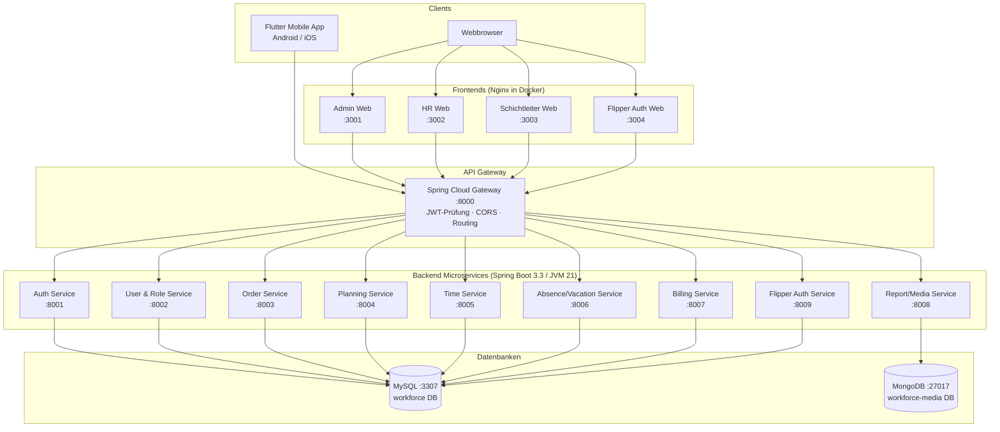

---

## 2. Deployment-Diagramm (Docker Compose)

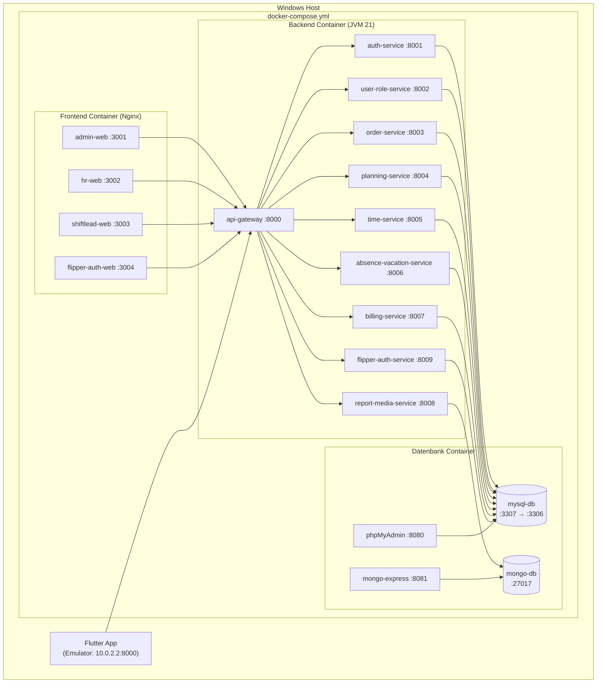

---

## 3. Klassendiagramm – Domänenmodell (alle JPA-Entitäten)

```mermaid
classDiagram
    direction TB

    class User {
        +Long id
        +String username
        +String email
        +String password
        +String firstName
        +String lastName
        +Role role
        +boolean active
        +LocalDateTime createdAt
    }

    class Role {
        +Long id
        +RoleName name
    }

    class RoleName {
        <<enumeration>>
        ADMIN
        HR
        SHIFT_LEAD
        EMPLOYEE
    }

    class WorkOrder {
        +Long id
        +String title
        +String description
        +String company
        +String location
        +LocalDate startDate
        +LocalDate endDate
        +String requiredRole
        +OrderStatus status
        +Long assignedShiftLeadId
        +Long createdBy
        +LocalDateTime createdAt
    }

    class OrderStatus {
        <<enumeration>>
        OPEN
        IN_PROGRESS
        DONE
    }

    class OrderEmployee {
        +OrderEmployeeId id
    }

    class OrderEmployeeId {
        +Long orderId
        +Long employeeId
    }

    class WorkPlan {
        +Long id
        +String title
        +Long shiftLeadId
        +LocalDate startDate
        +LocalDate endDate
        +Long hourBudgetId
        +BigDecimal approvedHours
        +WorkPlanStatus status
        +LocalDateTime createdAt
        +LocalDateTime publishedAt
        +List~Shift~ shifts
    }

    class HourBudget {
        +Long id
        +Long shiftLeadId
        +Integer year
        +Integer month
        +BigDecimal approvedHours
        +Long createdBy
        +String notes
        +LocalDateTime createdAt
        +LocalDateTime updatedAt
    }

    class WorkPlanStatus {
        <<enumeration>>
        DRAFT
        PUBLISHED
    }

    class Shift {
        +Long id
        +WorkPlan workPlan
        +Long orderId
        +Long employeeId
        +LocalDate shiftDate
        +LocalTime startTime
        +LocalTime endTime
        +String notes
    }

    class TimeEntry {
        +Long id
        +Long employeeId
        +LocalDateTime checkIn
        +LocalDateTime checkOut
        +Integer breakMinutes
        +BigDecimal totalHours
        +LocalDate entryDate
    }

    class Absence {
        +Long id
        +Long employeeId
        +AbsenceType type
        +LocalDate startDate
        +LocalDate endDate
        +String reason
        +AbsenceStatus status
        +Long reviewedBy
        +String rejectionReason
        +LocalDateTime createdAt
    }

    class AbsenceType {
        <<enumeration>>
        VACATION
        SICK
        OTHER
    }

    class AbsenceStatus {
        <<enumeration>>
        PENDING
        APPROVED
        REJECTED
    }

    class Invoice {
        +Long id
        +Long orderId
        +Long createdBy
        +BigDecimal totalHours
        +BigDecimal amount
        +InvoiceStatus status
        +LocalDateTime createdAt
        +List~InvoicePosition~ positions
    }

    class InvoiceStatus {
        <<enumeration>>
        DRAFT
        SENT
        PAID
    }

    class InvoicePosition {
        +Long id
        +Invoice invoice
        +String description
        +BigDecimal hours
        +BigDecimal rate
        +BigDecimal subtotal
    }

    class PayrollStatement {
        +Long id
        +Long employeeId
        +Integer year
        +Integer month
        +BigDecimal hourlyRate
        +BigDecimal totalHours
        +BigDecimal grossAmount
        +BigDecimal bonusAmount
        +BigDecimal deductionAmount
        +BigDecimal netAmount
        +PayrollStatus status
        +Long createdBy
        +LocalDateTime createdAt
        +LocalDateTime updatedAt
    }

    class PayrollStatus {
        <<enumeration>>
        DRAFT
        APPROVED
        PAID
    }

    class FlipperDevice {
        +Long id
        +String flipperId
        +Long userId
        +String secret
    }

    class AuthSession {
        +Long id
        +Long userId
        +String challenge
        +AuthAction action
        +LocalDateTime expiresAt
        +boolean used
        +boolean success
        +Integer breakMinutes
    }

    class MediaReport {
        <<MongoDB Document>>
        +String id
        +Long employeeId
        +Long orderId
        +String rapportId
        +String filename
        +String contentType
        +Integer fileSize
        +String storagePath
        +Instant uploadedAt
        +Map~String,Object~ metadata
        +byte[] data
    }

    User "many" --> "1" Role : hat
    Role --> RoleName
    WorkOrder --> OrderStatus
    WorkOrder "1" o-- "0..*" OrderEmployee : zugeordnete Mitarbeiter
    OrderEmployee --> OrderEmployeeId
    WorkPlan --> WorkPlanStatus
    WorkPlan --> HourBudget : nutzt HR-Freigabe
    WorkPlan "1" *-- "0..*" Shift : enthält
    Absence --> AbsenceType
    Absence --> AbsenceStatus
    Invoice --> InvoiceStatus
    PayrollStatement --> PayrollStatus
    Invoice "1" *-- "0..*" InvoicePosition : hat
```

---

## 4. ER-Diagramm (MySQL – workforce DB)

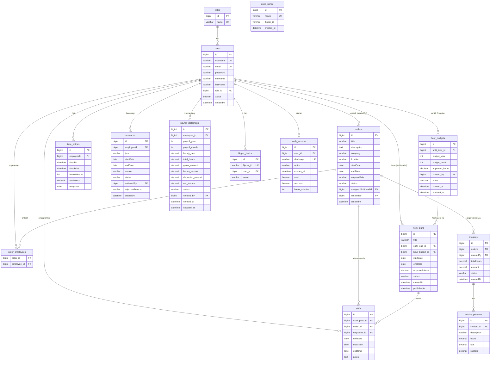

---

## 5. Sequenzdiagramm – Login & JWT-Authentifizierung

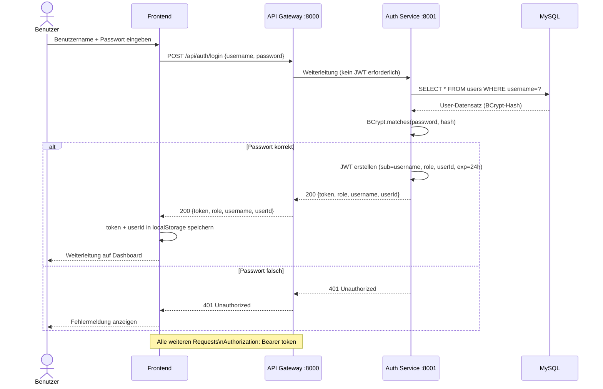

---

## 6. Sequenzdiagramm – Check-in / Check-out (Mobile App)

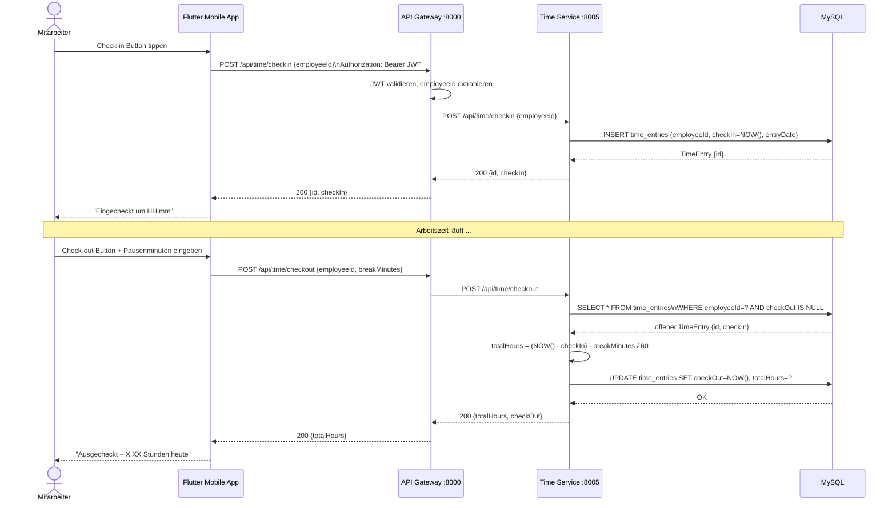

---

## 7. Sequenzdiagramm – Absenz einreichen & genehmigen

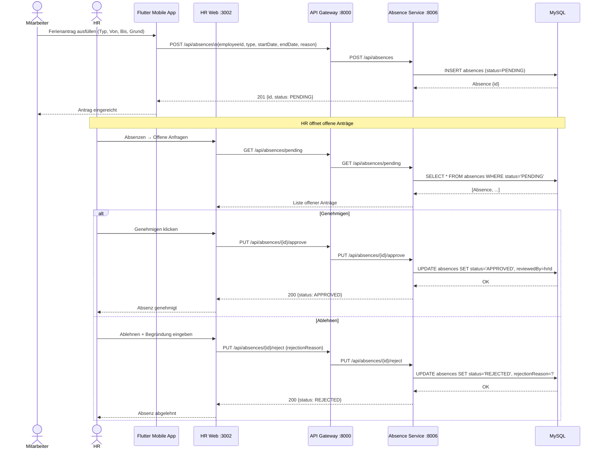

---

## 8. Sequenzdiagramm – Arbeitsplan erstellen & veröffentlichen

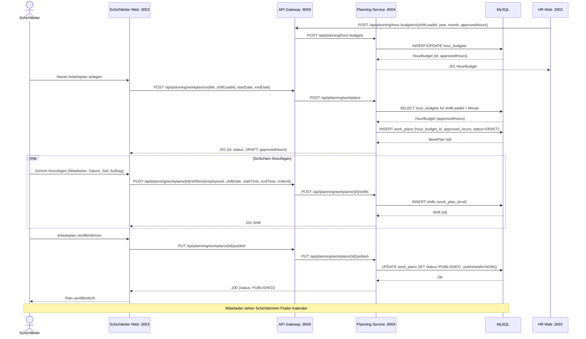

---

## 9. Sequenzdiagramm – Rapport-Bild hochladen (Mobile)

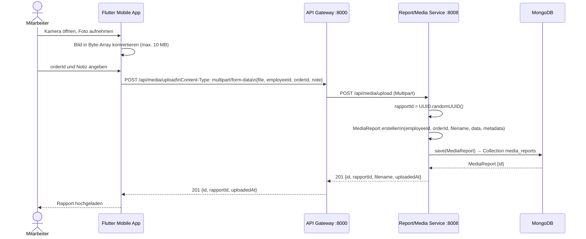

---

## 10. Statusdiagramme

### 10.1 Auftragsstatus (WorkOrder)

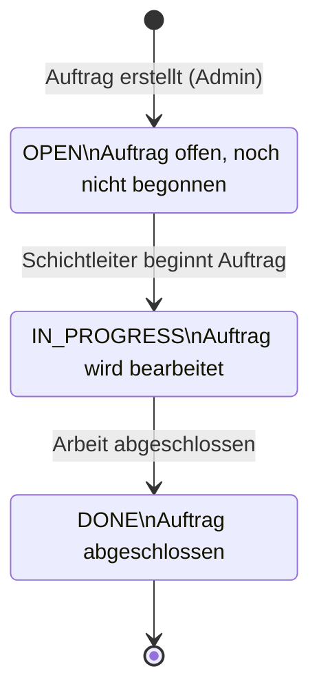

### 10.2 Absenz-Status

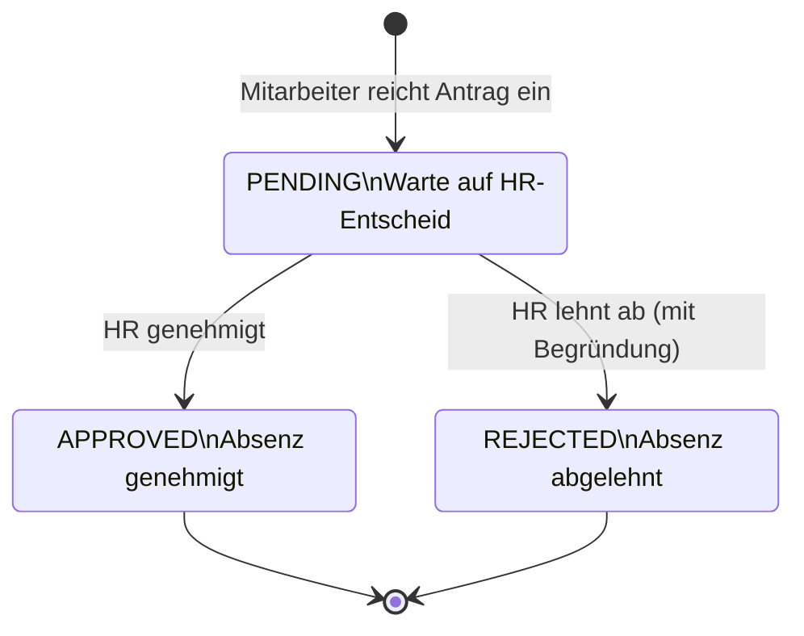

### 10.3 Rechnungsstatus (Invoice)

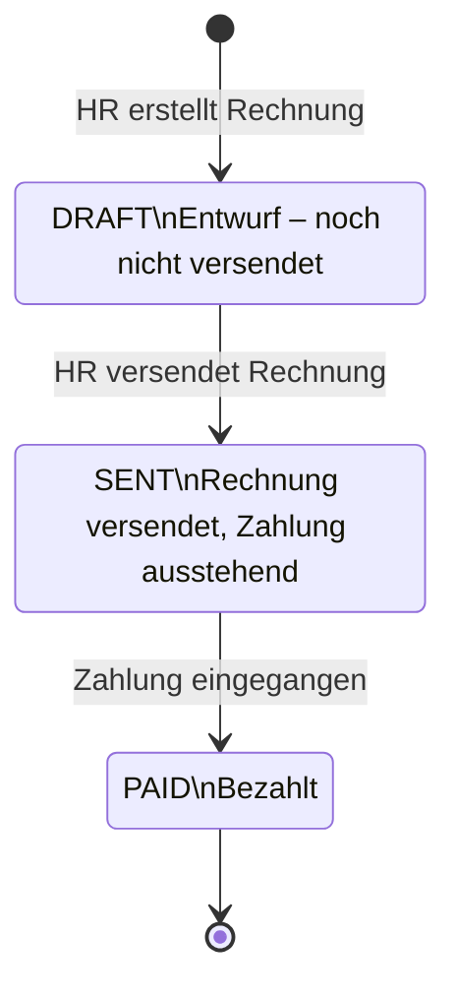

### 10.4 Arbeitsplan-Status (WorkPlan)

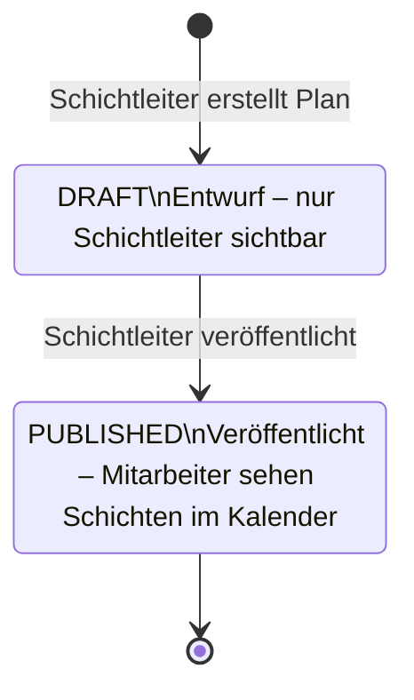

---

## 11. Use-Case-Diagramm

```mermaid
graph LR
    Admin(["Admin"])
    HR(["HR"])
    SL(["Schichtleiter"])
    EMP(["Mitarbeiter"])

    subgraph auth["Authentifizierung"]
        LOGIN(["Login / Logout"])
    end

    subgraph bv["Benutzerverwaltung"]
        BV1(["Benutzer anlegen"])
        BV2(["Benutzer bearbeiten"])
        BV3(["Rolle ändern"])
        BV4(["Benutzer deaktivieren"])
    end

    subgraph am["Auftragsmanagement"]
        AM1(["Auftrag erstellen"])
        AM2(["Auftrag zuweisen"])
        AM3(["Status ändern"])
        AM4(["Auftrag herunterladen"])
    end

    subgraph pl["Planung"]
        PL1(["Arbeitsplan erstellen"])
        PL2(["Schicht hinzufügen"])
        PL3(["Plan veröffentlichen"])
        PL4(["Kalender anzeigen"])
    end

    subgraph ze["Zeiterfassung"]
        ZE1(["Check-in"])
        ZE2(["Check-out"])
        ZE3(["Stunden anzeigen"])
    end

    subgraph ab["Absenzen"]
        AB1(["Absenz einreichen"])
        AB2(["Absenz genehmigen"])
        AB3(["Absenz ablehnen"])
    end

    subgraph bi["Rechnungen"]
        BI1(["Rechnung erstellen"])
        BI2(["Rechnung versenden"])
        BI3(["Als bezahlt markieren"])
    end

    subgraph rp["Rapport"]
        RP1(["Foto hochladen"])
        RP2(["Bilder anzeigen"])
    end

    Admin --- LOGIN
    HR --- LOGIN
    SL --- LOGIN
    EMP --- LOGIN

    Admin --- BV1 & BV2 & BV3 & BV4
    HR --- BV1 & BV2

    Admin --- AM1 & AM2 & AM3
    SL --- AM3
    EMP --- AM4

    SL --- PL1 & PL2 & PL3
    EMP --- PL4

    EMP --- ZE1 & ZE2
    HR --- ZE3
    SL --- ZE3

    EMP --- AB1
    HR --- AB2 & AB3

    HR --- BI1 & BI2 & BI3

    EMP --- RP1
    HR --- RP2
    Admin --- RP2
```